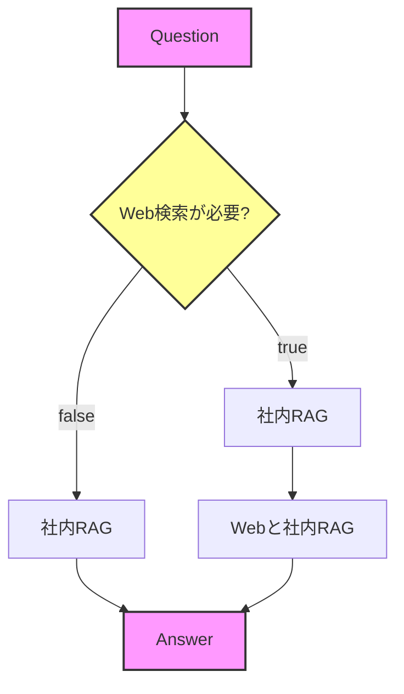

## RAGシステム仕様メモ

**基本的な挙動**

- **社内検索は常にON**とする。
    - Web検索の有無に関わらず、社内データベースへの検索は必ず実行されるフローとなっている。

**社内RAGモジュールの挙動**

- **ナレッジ不足時のフォールバック**:
    - 社内データベースに該当する知識（ドキュメント）が存在しない場合、「回答できません」と返すのではなく、LLM自身が持っている一般知識を用いて、**自分なりに回答を生成させる**ようにする。

## 実装修正プラン

### 機能の正しい理解
**Web検索機能の実際の動作**：
- 社内RAGが**最初に完成された回答を生成**する
- その回答を元に、Gemini（Google Search有効）がWeb検索を行い、社内RAGの回答とWebの情報を統合して最終回答を生成
- つまり、「社内RAG → Web検索で補強」という2段階処理

### 1. DTOの詳細仕様

#### 1-1. リクエストDTO (`llmGenerateRequest.dto.ts`)
```typescript
// 変更前
export const searchSettingsSchema = z.object({
  enableFileSearch: z.boolean().default(true),
  allowWebSearch: z.boolean().default(false),
  executeWebSearch: z.boolean().optional(),
});

// 変更後
export const llmGenerateRequestSchema = z.object({
  question: z.string().trim().min(1, 'question must not be empty.'),
  conversationId: z.string().uuid('conversationId must be a valid UUID'),
  requireWebSearch: z.boolean().default(false), // Web検索で補強するか
});

export type LlmGenerateRequestDto = z.infer<typeof llmGenerateRequestSchema>;
```

**リクエスト例**：
```json
// Web検索なし（デフォルト）
{
  "question": "新入社員の研修プログラムについて教えてください",
  "conversationId": "123e4567-e89b-12d3-a456-426614174000",
  "requireWebSearch": false
}

// Web検索あり
{
  "question": "最新のAI技術トレンドについて教えてください",
  "conversationId": "123e4567-e89b-12d3-a456-426614174000", 
  "requireWebSearch": true
}
```

#### 1-2. レスポンスDTO (`llmGenerateResponse.dto.ts`)
```typescript
// 変更後
export enum ResponseType {
  ANSWER = 'ANSWER', // 通常の回答
  // WEB_SEARCH_CONFIRMATION を削除
}

// WebSearchConfirmationLabels を削除
// needsWebSearch, webSearchReason, confirmationLabels フィールドを削除

export type LlmGenerateResponseDto = {
  type: ResponseType;
  answer: string;
  sources?: ResponseSources; // そのまま維持
};
```

**レスポンス例**：
```json
// Web検索なしの場合
{
  "type": "ANSWER",
  "answer": "新入社員の研修プログラムは3段階で構成されています...",
  "sources": {
    "fileSearch": [
      {
        "fileName": "training-manual.pdf",
        "documentId": "doc_abc123",
        "chunks": [
          {
            "text": "第1週：オリエンテーション...",
            "pageStart": 10,
            "confidence": 0.95
          }
        ]
      }
    ]
  }
}

// Web検索ありの場合
{
  "type": "ANSWER",
  "answer": "社内資料とWeb情報を統合した結果：\n📄 社内では...\n🌐 最新のトレンドとして...",
  "sources": {
    "fileSearch": [...],
    "webSearch": [
      {
        "title": "2024年AIトレンド",
        "url": "https://example.com/ai-trends",
        "snippet": "生成AIの進化..."
      }
    ]
  }
}
```

### 2. HybridRagAssistantの処理フロー修正
**対象ファイル**: `src/llm/external/hybridRagAssistant.ts`

#### 変更前の処理フロー（複雑）
1. 質問タイプ判定
2. FileSearch実行可否判断  
3. Web検索承認確認
4. 段階的エスカレーション

#### 変更後の処理フロー（シンプル＆正確）
```typescript
async answerQuestion(question: string, options: HybridSearchOptions): Promise<HybridAnswerResult> {
  // Step 1: 必ず社内RAGを実行（完成された回答を取得）
  const ragResult = await this.tryFileSearch(question, options);
  
  // Step 2: Web検索が必要な場合、RAG結果を元にWeb補強
  if (options.requireWebSearch) {
    // 社内RAGの回答を元にGemini（Google Search有効）で補強
    const enhancedResult = await this.enhanceWithWebSearch(
      question,
      ragResult.answer, // 社内RAGの完成された回答
      options
    );
    
    return {
      type: ResponseType.ANSWER,
      answer: enhancedResult.answer,
      message: enhancedResult.message,
      sources: {
        fileSearch: ragResult.sources?.fileSearch,
        webSearch: enhancedResult.webSources
      }
    };
  }
  
  // Step 3: Web検索不要の場合は社内RAGの結果をそのまま返す
  return ragResult;
}

// 新メソッド：社内RAGの回答をWeb検索で補強
private async enhanceWithWebSearch(
  originalQuestion: string,
  ragAnswer: string,
  options: FileSearchAnswerOptions
): Promise<EnhancedResult> {
  const enhancementPrompt = `
以下の社内RAGの回答を、Web検索機能を使って補強してください。

【元の質問】
${originalQuestion}

【社内RAGの回答】
${ragAnswer}

【指示】
1. 上記の社内RAGの回答を基に、関連する最新情報をWeb検索で調査
2. 社内情報とWeb情報を統合した包括的な回答を生成
3. 情報源を明確に区別（📄 社内 / 🌐 Web）
4. 矛盾がある場合は社内情報を優先
`;

  // Gemini with Google Search でWeb補強
  return await this.geminiWithSearch.generate(enhancementPrompt);
}
```

### 3. FileSearch（社内RAG）の挙動改善
**対象ファイル**: `src/llm/external/geminiFileSearchAssistant/geminiFileSearchAssistantService.ts`

#### 現在の問題点
- 社内ドキュメントが見つからない場合「情報が見つかりませんでした」を返す
- FILE_SEARCH_INSTRUCTIONが厳格すぎる

#### 修正内容
1. **FILE_SEARCH_INSTRUCTIONの緩和**（`src/llm/llm.service.ts:26-34`）
   ```typescript
   const FILE_SEARCH_INSTRUCTION = `
   あなたは社内RAGシステムを活用するAIアシスタントです。以下のルールに従ってください：
   
   1. 提供されたコンテキストがある場合は、それを優先的に使用してください
   2. コンテキストに情報がない場合は、あなたの一般知識を使って有益な回答を提供してください
   3. 回答にコンテキストを使用した場合は、引用元を明記してください
   4. 日本語で丁寧に回答してください
   `;
   ```

2. **GeminiFileSearchAssistantServiceの修正**
   - groundingConfigの調整で、ドキュメントが見つからない場合でもLLMが回答生成できるようにする
   - `RETRIEVAL_FAILS_FALLBACK_TO_LLM`オプションの有効化（存在する場合）

### 4. 不要なコードの削除
以下の機能を削除：
- Web検索確認ダイアログ関連（`createWebSearchConfirmation`）
- 質問タイプ分類（`classifyQuestion`）  
- Web検索必要性判断（`shouldAskForWebSearch`）
- 言語検出とボタンラベル（`detectLanguageAndGetLabels`）
- ResponseType.WEB_SEARCH_CONFIRMATION
- SearchSettingsの古いフィールド（`enableFileSearch`, `allowWebSearch`, `executeWebSearch`）

### 5. LlmService/Controllerの修正

#### 5-1. LlmController (`llm.controller.ts`)
```typescript
@Post('generate')
async generate(@Body() payload: LlmGenerateRequestDto) {
  this.logger.log(
    `Received LLM generate request: ` +
    `question="${payload.question.substring(0, 50)}..." ` +
    `webSearch=${payload.requireWebSearch}` // シンプルに
  );

  const command: LlmGenerateCommand = {
    prompt: payload.question,
    conversationId: payload.conversationId as UUID,
    requireWebSearch: payload.requireWebSearch, // 新フィールド
  };

  const result = await this.llmService.generate(command);

  return {
    type: result.type,
    answer: result.answer,
    sources: result.sources, // needsWebSearch等は削除
  };
}
```

#### 5-2. LlmService (`llm.service.ts`)
```typescript
export type LlmGenerateCommand = {
  prompt: string;
  conversationId: UUID;
  requireWebSearch: boolean; // SearchSettingsから変更
};
```

### 6. Web検索補強の実装詳細

#### 6-1. WebSearchAssistantの修正
**対象ファイル**: `src/llm/external/webSearchAssistant.ts`

既存の実装で既に`googleSearch`ツールを使用しているため、以下の修正のみ：

```typescript
// 社内RAGの回答を元にWeb補強する新メソッド追加
async enhanceWithSearch(
  originalQuestion: string,
  ragAnswer: string,
  systemInstruction: string // PersonalityPreset + MBTI適用済み
): Promise<WebSearchResult> {
  const enhancementPrompt = `
以下の社内RAGの回答を、Web検索機能を使って補強してください。

【元の質問】
${originalQuestion}

【社内RAGの回答】
${ragAnswer}

【指示】
1. 上記の社内RAGの回答を基に、関連する最新情報をWeb検索で調査
2. 社内情報とWeb情報を統合した包括的な回答を生成
3. 情報源を明確に区別（📄 社内 / 🌐 Web）
4. 矛盾がある場合は社内情報を優先
`;

  // 既存のsearchメソッドを活用（Google Search有効済み）
  return await this.search(enhancementPrompt, { systemInstruction });
}
```

#### 6-2. キャッシュ戦略の追加
**対象ファイル**: `src/llm/cache/inMemoryCacheService.ts`

```typescript
// 既存のキャッシュサービスに追加
private readonly webSearchCache = new Map<string, CacheEntry<WebSearchResult>>();

// TTL設定に追加
private readonly TTL = {
  SYSTEM_PROMPT: 60 * 60 * 1000, // 1時間
  CONVERSATION: 30 * 60 * 1000,  // 30分
  WEB_SEARCH: 30 * 60 * 1000,    // 30分（Web検索結果）
};

// Web検索キャッシュメソッド
async getOrCreateWebSearch(
  cacheKey: string, // question + ragAnswer のハッシュ
  generator: () => Promise<WebSearchResult>
): Promise<WebSearchResult> {
  // 既存のgetOrCreateと同様のロジック
  // Mutex Lock、TTL管理、自動クリーンアップ対応
}
```

#### 6-3. エラーハンドリングの強化

```typescript
// HybridRagAssistant内
try {
  const enhancedResult = await this.webAssistant.enhanceWithSearch(
    question,
    ragResult.answer,
    options.systemInstruction // システムプロンプト適用
  );
  // 成功時の処理
} catch (error) {
  this.logger.error('Web search enhancement failed', error);
  
  // Web検索失敗時は社内RAGの結果にエラーメッセージを追加
  return {
    ...ragResult,
    answer: `${ragResult.answer}\n\n※ Web検索でエラーが発生しました: ${error.message}`,
  };
}

```

### 7. 料金情報

**Gemini with Google Search（Grounding）の料金**:
- **$35 per 1,000 grounded queries**（約5,250円/1000クエリ）
- **無料枠**: 1日1,500クエリ（Gemini 2.5 Flash/Pro）
- **Gemini 2.0 Flash Live**: プレビュー期間中は無料
- **注意**: Gemini 3では検索クエリごとに課金（1プロンプトで複数検索すると複数課金）

### 8. テストシナリオ
1. **社内RAGのみ**: `requireWebSearch: false`で社内情報のみ返却
2. **Web補強あり**: `requireWebSearch: true`で社内RAG → Web補強の2段階処理
3. **フォールバック**: 社内ドキュメントなしでもLLMの一般知識で回答
4. **エラー処理**: Web検索失敗時は社内RAG結果＋エラーメッセージ
5. **キャッシュ動作**: 同一質問＋RAG回答の組み合わせで30分間キャッシュ
6. **レスポンス時間**: Web補強ありでも適切な時間内に応答（タイムアウト設定）
